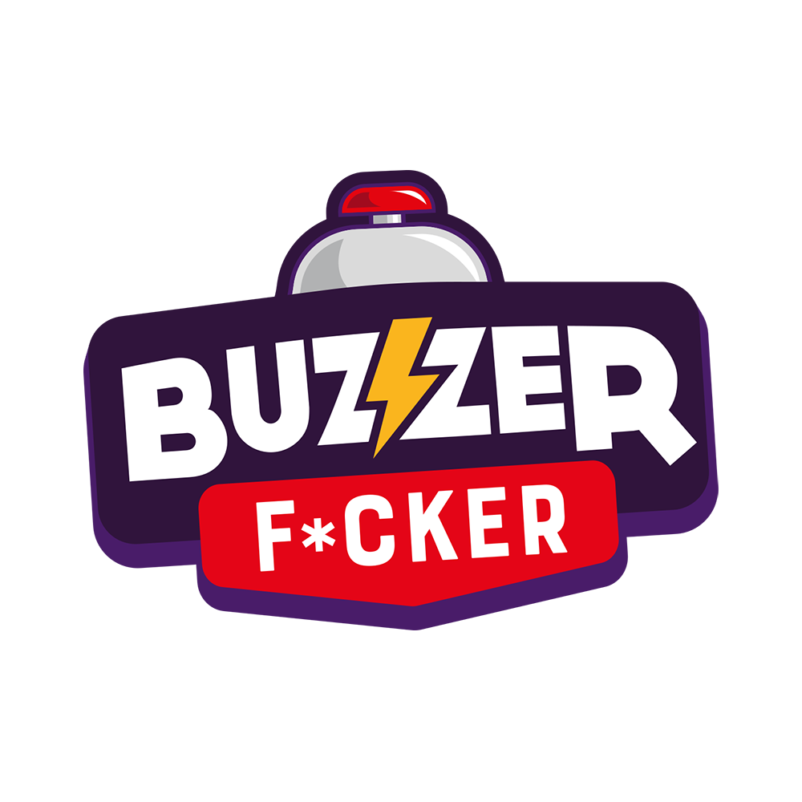

<!-- PROJECT SHIELDS -->
<!--
*** I'm using markdown "reference style" links for readability.
*** Reference links are enclosed in brackets [ ] instead of parentheses ( ).
*** See the bottom of this document for the declaration of the reference variables
*** for contributors-url, forks-url, etc. This is an optional, concise syntax you may use.
*** https://www.markdownguide.org/basic-syntax/#reference-style-links
-->
[![Contributors][contributors-shield]][contributors-url]
[![Forks][forks-shield]][forks-url]
[![Stargazers][stars-shield]][stars-url]
[![Issues][issues-shield]][issues-url]
[![MIT License][license-shield]][license-url]
[![LinkedIn][linkedin-shield]][linkedin-url]

<!-- PROJECT LOGO -->
 

  

<h3 align="center">Dice Frequency for multilingual Buzzer Master</h3>

  

    A jupyter notebook to extract the first letter frequency of a latin language from a dictionnary and give the appropriate dice distribution to play Buzzer Master in that language.
     
    <a href="https://github.com/Coincoin-Dataduck/Buzzer-Master-Dice-Frequency"><strong>Explore the docs »</strong></a>
     
     
    <a href="https://github.com/Coincoin-Dataduck/Buzzer-Master-Dice-Frequency/issues">Report Bug</a>
    ·
    <a href="https://github.com/Coincoin-Dataduck/Buzzer-Master-Dice-Frequency/issues">Request Feature</a>
  

<!-- TABLE OF CONTENTS -->

  
Table of Contents

  <ol>
    <li>
      <a href="#about-the-project">About The Project</a>
      <ul>
        <li><a href="#built-with">Built With</a></li>
      </ul>
    </li>
    <li>
      <a href="#getting-started">Getting Started</a>
      <ul>
        <li><a href="#prerequisites">Prerequisites</a></li>
        <li><a href="#installation">Installation</a></li>
      </ul>
    </li>
    <li><a href="#usage">Usage</a></li>
    <li><a href="#roadmap">Roadmap</a></li>
    <li><a href="#contributing">Contributing</a></li>
    <li><a href="#license">License</a></li>
    <li><a href="#contact">Contact</a></li>
    <li><a href="#acknowledgments">Acknowledgments</a></li>
  </ol>

<!-- ABOUT THE PROJECT -->
## About The Project

[![Product Name Screen Shot][product-screenshot]](https://example.com)

 Buzzer Master is a game by [The Right to loose](https://ledroitdeperdre.com/), a french publisher of party games. Blue Orange is responsible for the international distribution of those creations. With its distribution network of 85 partners in 62 countries, Blue Orange develops advanced tools to help maximize the spreading of those great games.
 This tools extract from a CSV constructed by dictonnary the frequency of first lettre in each language added to the file. From this stat it give another CSV file with de corect distribution of letters for each of the four dices.
 [Buzzer Master](https://ledroitdeperdre.com/nos-jeux/35-buzzer-fcker.html) rules can be found [here](https://www.dropbox.com/s/p1cw8xl3x7j5war/MotherBuzzer-%20Rules%20%28demo%29.pdf?dl=0)

(<a href="#top">back to top</a>)

### Built With

* [jupyter](https://jupyter.org/)

(<a href="#top">back to top</a>)

<!-- GETTING STARTED -->
## Getting Started

This is an example of how you may give instructions on setting up your project locally.
To get a local copy up and running follow these simple example steps.

### Prerequisites

* [jupyter environnement](https://www.anaconda.com/products/individual)
* spreadsheet sofware

### Installation

1. Add your dictionnary to wordlist.csv
2. Run the script in your IDE
3. Get your result in frequancedes.csv

<!-- ROADMAP -->
## Roadmap

- [ ] Clean the code
- [ ] Optimisation
- [ ] GUI interface

See the [open issues](https://github.com/Coincoin-Dataduck/Buzzer-Master-Dice-Frequency/issues) for a full list of proposed features (and known issues).

(<a href="#top">back to top</a>)

<!-- CONTRIBUTING -->
## Contributing

Contributions are what make the open source community such an amazing place to learn, inspire, and create. Any contributions you make are **greatly appreciated**.

If you have a suggestion that would make this better, please fork the repo and create a pull request. You can also simply open an issue with the tag "enhancement".
Don't forget to give the project a star! Thanks again!

1. Fork the Project
2. Create your Feature Branch (`git checkout -b feature/AmazingFeature`)
3. Commit your Changes (`git commit -m 'Add some AmazingFeature'`)
4. Push to the Branch (`git push origin feature/AmazingFeature`)
5. Open a Pull Request

(<a href="#top">back to top</a>)

<!-- LICENSE -->
## License

Distributed under the MIT License. See `LICENSE.txt` for more information.

(<a href="#top">back to top</a>)

<!-- CONTACT -->
## Contact

Clément Fontaine - clement@blueornagegames.eu

Project Link: [https://github.com/Coincoin-Dataduck/Buzzer-Master-Dice-Frequency](https://github.com/Coincoin-Dataduck/Buzzer-Master-Dice-Frequency)

(<a href="#top">back to top</a>)

<!-- MARKDOWN LINKS & IMAGES -->
<!-- https://www.markdownguide.org/basic-syntax/#reference-style-links -->
[contributors-shield]: https://img.shields.io/github/contributors/Coincoin-Dataduck/Buzzer-Master-Dice-Frequency.svg?style=for-the-badge
[contributors-url]: https://github.com/Coincoin-Dataduck/Buzzer-Master-Dice-Frequency/graphs/contributors
[forks-shield]: https://img.shields.io/github/forks/Coincoin-Dataduck/Buzzer-Master-Dice-Frequency.svg?style=for-the-badge
[forks-url]: https://github.com/Coincoin-Dataduck/Buzzer-Master-Dice-Frequencye/network/members
[stars-shield]: https://img.shields.io/github/stars/Coincoin-Dataduck/Buzzer-Master-Dice-Frequency.svg?style=for-the-badge
[stars-url]: https://github.com/Coincoin-Dataduck/Buzzer-Master-Dice-Frequency/stargazers
[issues-shield]: https://img.shields.io/github/issues/Coincoin-Dataduck/Buzzer-Master-Dice-Frequency.svg?style=for-the-badge
[issues-url]: https://github.com/Coincoin-Dataduck/Buzzer-Master-Dice-Frequency/issues
[license-shield]: https://img.shields.io/github/license/Coincoin-Dataduck/Buzzer-Master-Dice-Frequency.svg?style=for-the-badge
[license-url]: https://github.com/Coincoin-Dataduck/Buzzer-Master-Dice-Frequency/blob/master/LICENSE.txt
[linkedin-shield]: https://img.shields.io/badge/-LinkedIn-black.svg?style=for-the-badge&logo=linkedin&colorB=555
[linkedin-url]: https://www.linkedin.com/in/cl%C3%A9ment-f-a6b85083/
[product-screenshot]: images/screenshot.png
